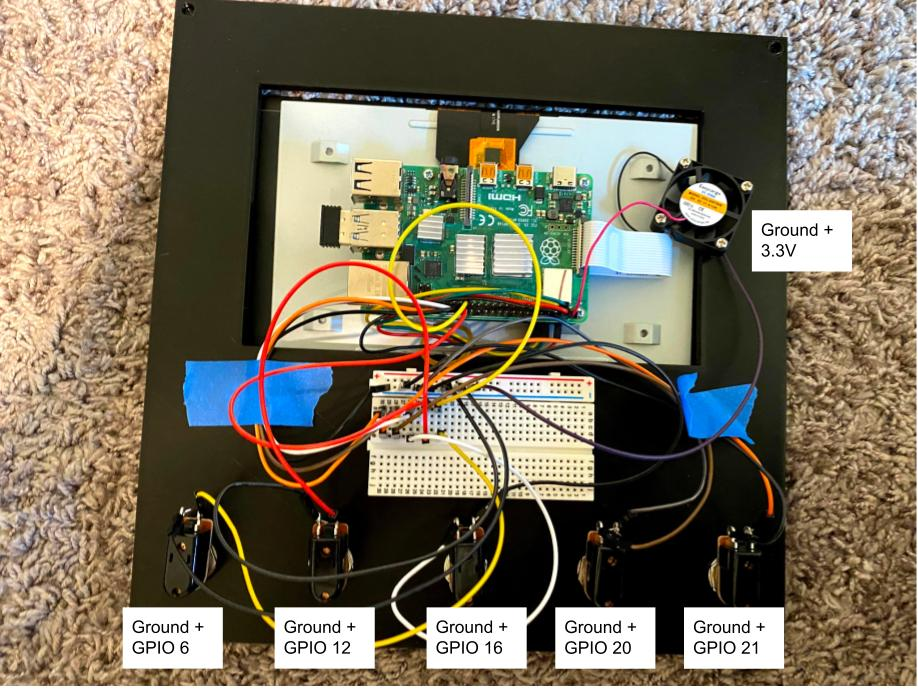

# Guitar Effects Processor

A low latency guitar effects processor in C++ suitable for running on smaller
boards (e.g. a raspberry pi).

# How it works

## High level overview

The [web UI](https://github.com/Quinny/GuitarEffects/tree/master/web/static)
calls into the [web server](https://github.com/Quinny/GuitarEffects/tree/master/web)
which then manipulates the [pedal board](https://github.com/Quinny/GuitarEffects/blob/master/web/pedal_board.h).

## Sound card interface

The [AudioTransformer](https://github.com/Quinny/GuitarEffects/blob/master/audio_transformer.h) class uses [RtAudio](http://www.music.mcgill.ca/~gary/rtaudio/index.html) to interface with the sound card.

The values read from the soundcard are then streamed into the provided
transformation function and written back out to the output device.

## Pedals

[pedal.h](https://github.com/Quinny/GuitarEffects/blob/master/pedal.h) defines
an interface for all pedals to conform to.

### Transformation

The root of it is the `Transform` function which takes an input signal, performs
any kind of transformation, and returns an output. All input and output values
should remain in the range [-1, 1] otherwise you'll produce some really gnarly
popping and cracking.

Many of the pedals utilize the [Q](https://github.com/cycfi/Q) library for some
signal processing primitives (e.g. filters, compression, etc.). Some other
utility classes can be found in the [fx](https://github.com/Quinny/GuitarEffects/tree/master/fx)
directory of this repo.

### Knobs

The `Describe` function advertises the current state of the pedal, primarily
the knobs. These knob name and values will be used to display in the UI
(covered later).

`AdjustKnob` provides a knob from the UI and relies on the implementation to
make the required changes to the pedal. These changes should be applied in a way
such that subsequent calls to `Describe` will reflect these changes (otherwise
the UI won't update).

### Registration

Each pedal should register itself via the `REGISTER_PEDAL` macro. This connects
the pedal to the [PedalRegistry](https://github.com/Quinny/GuitarEffects/blob/master/pedal_registry.h) so that other components can find it without explicitly knowing
about its existence.

## Pedal Board

The [PedalBoard](https://github.com/Quinny/GuitarEffects/blob/master/web/pedal_board.h)
essentially just wraps a list of pedals and chains their `Transform` functions.

## Web Server

The [web server](https://github.com/Quinny/GuitarEffects/blob/master/web/main.cpp)
uses the [crow](https://github.com/ipkn/crow) library to expose endpoints that
manipulate the pedal board.

The [PedalRegistry](https://github.com/Quinny/GuitarEffects/blob/master/pedal_registry.h)
is used here to automatically expose newly added pedals. You only need to add
an include statement within the [handlers](https://github.com/Quinny/GuitarEffects/blob/master/web/handlers.h) file to trigger the registration.

## Web UI

The web UI uses [React](https://reactjs.org). The bulk of the logic lives in
[app.jsx](https://github.com/Quinny/GuitarEffects/blob/master/web/static/app.jsx).

# Building the server

1. First clone the repo: `git clone --recurse-submodules https://github.com/Quinny/GuitarEffects`

1. Then install RtAudio. The steps here depend slightly on the platform you are
building on. See [install.txt](https://github.com/thestk/rtaudio/blob/master/install.txt) from the RtAudio repo. After following all the steps there run `make install` in the RtAudio directory so that the library files can be linked properly.

1. Install boost using your package manager (e.g. `brew`, `apt-get`, `yum`, etc).
If you Google "Install boost using `<package_manager>` you should find the
corresponding package name.

1. Install sdl2 using your package manager (e.g. `brew`, `apt-get`, `yum`, etc.).
If you Google "Install sdl on `<platform>` you should find more detailed
instructions.

1. Run `make server` from this repo's root.

1. Open a github issue if I missed a required dependency.

# Running the server

From the `web` directory, run `sudo ../bin/server` (sudo is required to run on
port 80).

# Setting up on a Raspberry Pi

## Parts List

1. Raspberry Pi 4
1. [7 inch touch screen](https://www.amazon.com/Raspberry-Pi-7-Touchscreen-Display/dp/B0153R2A9I/)
1. [5 push buttons](https://www.amazon.com/gp/product/B0751BHY99) - Any buttons that are the same diameter shouyd work
1. [Bunch of jumper wires](https://www.amazon.com/gp/product/B01EV70C78) - Any jumper wires should work
1. [Bread board](https://www.amazon.com/gp/product/B07PCJP9DY) - You can probably get away without this, but I wanted a common ground
1. [Fan](https://www.amazon.com/GeeekPi-Raspberry-30x30x7mm-Brushless-Retroflag/dp/B07C9C99RM) - Any small-ish 3.3v fan should work
1. [3D printed case](case/)
1. [Behringer audio interface](https://www.amazon.com/BEHRINGER-Audio-Interface-1-Channel-UM2/dp/B00EK1OTZC) - Any audio interface will work
1. [USB extension cable](https://www.amazon.com/gp/product/B06XXL2H6F) - This makes it easier to plug the audio interface into the Pi through the opening in the back of the case, any brand should work
1. [Pi 4 power switch](https://www.amazon.com/gp/product/B07WFVQ6K5) - This makes it easier to turn the Pi on and off through the opening in the back of the case, any brand should work

## Assembly

1. Mount the Pi to the back of the touch screen and hook up the ribbon cable and GPIO pins according to the instructions on the product page
1. Mount the buttons to the top of the case by unscrewing the ring on the button, putting the button through the hole in the case, and then screw down the ring again.
   Make sure the terminals for the button are facing towards the screen to leave room for the wires
1. (Optional) Mount the breadboard in the empty space between the buttons and the screen hole
1. Mount the screen in the top of the case and lay it flat so the terminals of the buttons are facing up
1. Wire one terminal from each button to a ground connection
1. Wire the other terminal to a GPIO pin, from left to right:
   1. Pin 6
   1. Pin 12
   1. Pin 16
   1. Pin 20
   1. Pin 21
1. Wire the fan to any open 3.3v terminal and ground
1. Plug in the USB extension and power switch cords
1. Place the top of the case into the bottom, threading the extension and power
   cords through the opening in the back

Note that since the server program exposes an HTTP server you can actually
navigate to the IP address of your PI from any device connected to the same
wifi and control your pedal chain from there.
